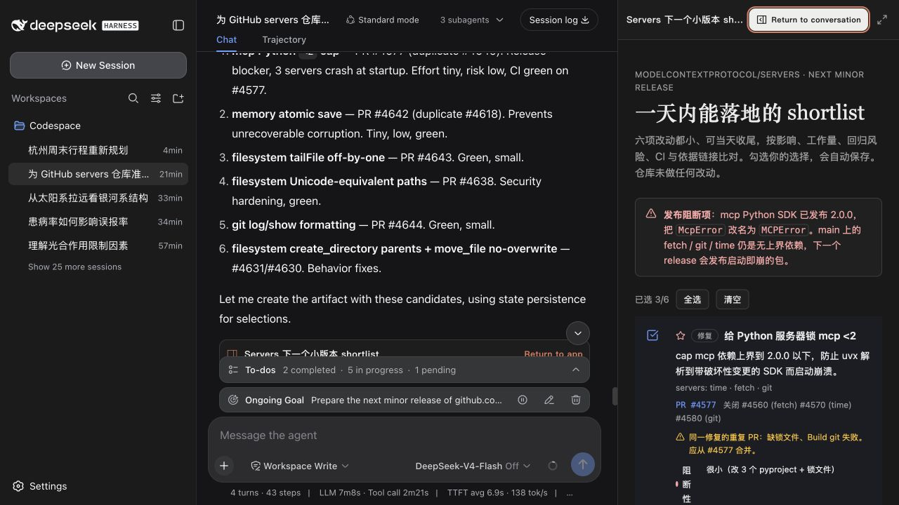
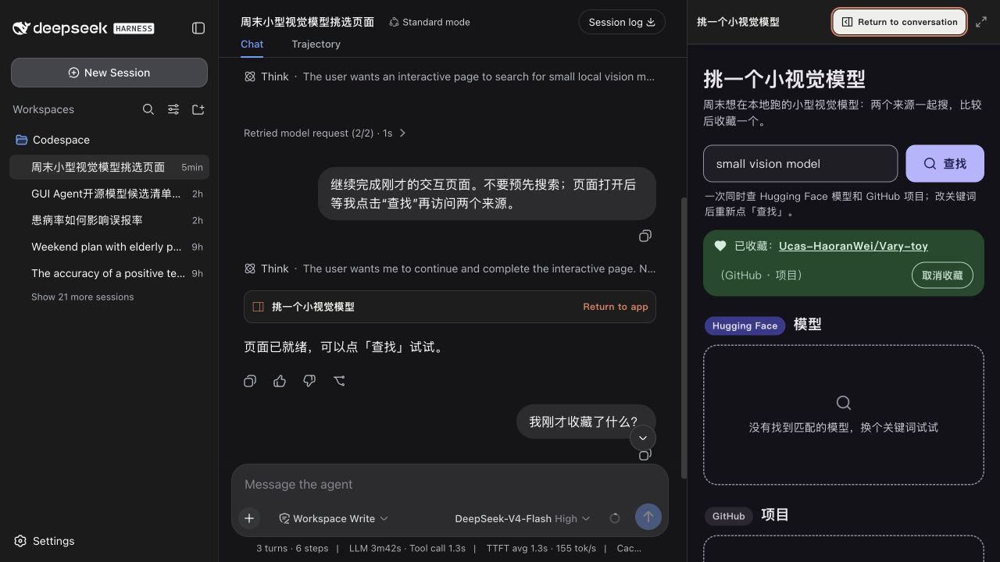
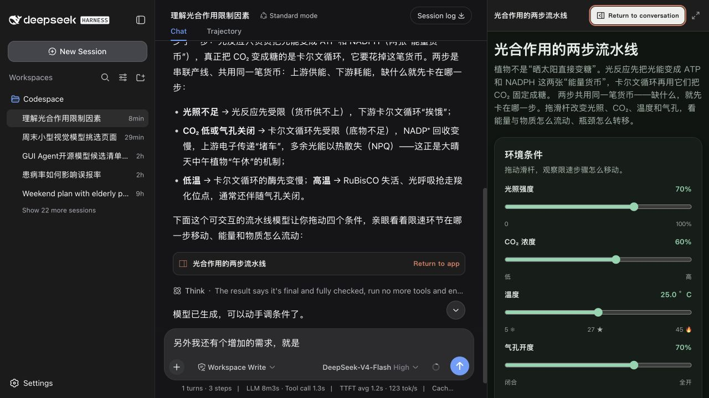
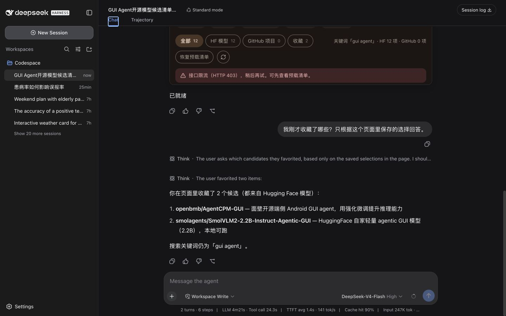

# DeepSeek Harness GenUI

[](package.json)
[](https://github.com/pengyue-polaron/deepseek-harness-genui/actions/workflows/ci.yml)
[](package.json)
[](LICENSE)


Generative UI for DeepSeek Harness. The user describes the outcome in plain language. The Agent answers in chat and, only when interaction helps, creates a disposable React app inside the same task.

**Request → answer in chat → working UI → saved interaction → next Agent turn**

## Where it earns its place

<table>
  <thead>
    <tr>
      <th>Need</th>
      <th>Answer in chat</th>
      <th>Generated UI</th>
    </tr>
  </thead>
  <tbody>
    <tr>
      <td><strong>Pause a long task at the right decision</strong><br><br>“Prepare a one-day release shortlist from recent issues, PRs, and failed Actions. Do not change the repository until I confirm it.”</td>
      <td>The Agent explains the release blocker, competing fixes, effort, risk, and what still needs a human decision.</td>
      <td><br><br>A source-linked shortlist with saved selections. The Agent continues the release plan from the confirmed set.</td>
    </tr>
    <tr>
      <td><strong>Work across tools without building an integration</strong><br><br>“Find small vision models and related implementations. Search the sources I connected, then let me keep the useful ones.”</td>
      <td>The Agent states what it can search, asks for permission at first use, and keeps credentials out of the generated app.</td>
      <td><br><br>One temporary workspace over Hugging Face and GitHub, with search, source filters, and favorites.</td>
    </tr>
    <tr>
      <td><strong>Explain a relationship that changes</strong><br><br>“Show me which part of photosynthesis becomes limiting when light, CO₂, temperature, or stomata change.”</td>
      <td>The Agent first explains the light reactions, ATP/NADPH, Calvin cycle, and the likely bottleneck in plain language.</td>
      <td><br><br>A causal model with sliders and live energy and matter flow, not a decorative diagram.</td>
    </tr>
    <tr>
      <td><strong>Let the next turn use what happened in the UI</strong><br><br>“Which candidates did I just favorite? Read only the choices saved in the page.”</td>
      <td>The Agent reads the task-scoped state and answers with the exact selected items instead of guessing from chat history.</td>
      <td><br><br>The generated app is a two-way task surface: user interaction becomes context for the next step.</td>
    </tr>
  </tbody>
</table>

These are ordinary task prompts, not hard-coded demos. The useful boundary is simple: prose carries the answer; UI carries the interaction.

## What it adds

- Inline, adaptive Canvas, and full-screen surfaces inside the conversation.
- Normal multi-file React + TypeScript; no component-tree IR.
- Task-scoped state that the Agent can read on the next turn.
- Existing Harness and MCP tools behind explicit, first-use permission prompts.
- Approved public HTTPS requests without exposing credentials to app code.
- Sandboxed builds with desktop, mobile, dark-mode, overflow, motion, and accessibility checks.
- Reusable visual direction through `DESIGN.md`.

Good fits include decision checkpoints, temporary tool workspaces, structured feedback, exception review, live incident triage, data reconciliation, and explorable models. Plain questions, rewriting, and straightforward explanations stay in prose.

## Install

Requires Node.js `^22.19.0 || >=24`, pnpm 11, DeepSeek Harness, and Playwright Chromium.

```sh
pnpm install --frozen-lockfile
pnpm exec playwright install chromium
pnpm run package:plugin
```

```sh
DSH_HOME=/path/to/dsh-home pnpm dsh plugin --profile web add /absolute/path/to/dsh-plugin-genui-0.10.2.tgz
DSH_HOME=/path/to/dsh-home pnpm dsh --profile web
```

Add MCP servers to the Harness profile. Generated apps call their exact tool names; credentials never enter generated source or app state.

## Design

Open **Settings → Plugins → Plugin configuration** to keep automatic styling, choose a built-in direction, or import a `DESIGN.md`. The selected default applies to new apps; each existing app keeps the design pinned to its version.

## Stack

| Layer | Choice |
| --- | --- |
| Host | DeepSeek Harness + Cordis |
| App code | React 18 + TypeScript |
| Build | esbuild |
| Isolation | sandboxed iframe + capability tokens |
| Verification | Playwright + Vitest |
| Tools | Harness/MCP calls + approved public HTTPS |
| State | task-scoped artifact state, 7-day inactivity expiry |

## Development

Acceptance prompts live in [`examples/real-user-scenarios.md`](examples/real-user-scenarios.md).

```sh
pnpm run typecheck
pnpm test
pnpm run package:plugin
```

MIT
