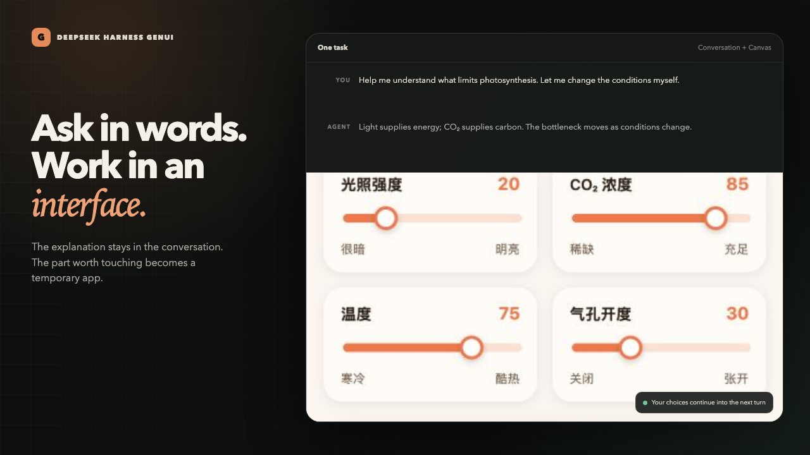
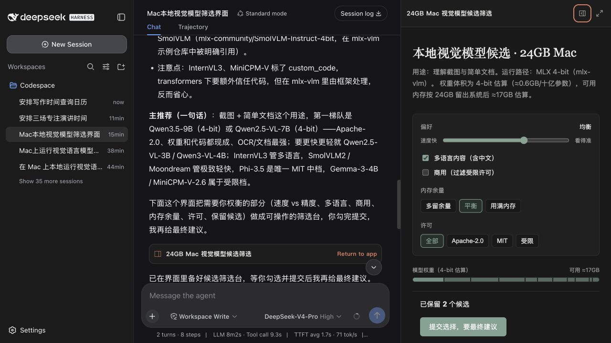
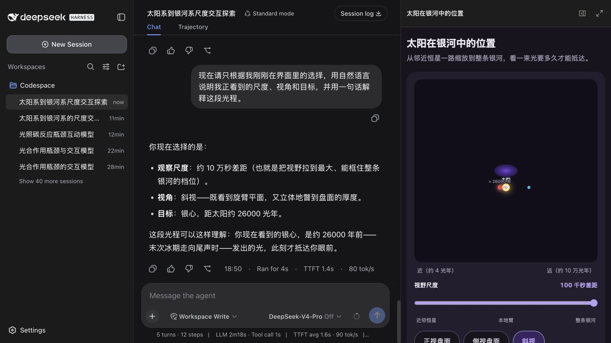
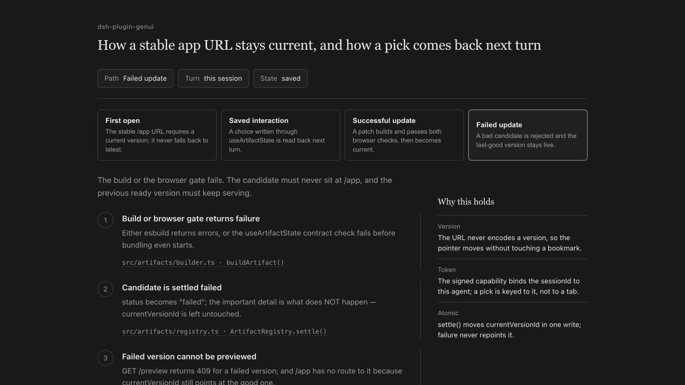

# DeepSeek Harness GenUI

[](package.json)
[](LICENSE)



A DeepSeek Harness plugin that turns the interactive part of a task into a temporary React app. The answer stays in chat; decisions, exploration, and tool actions get a focused interface only when one helps.

**Ask in plain language -> read the answer -> use the UI -> continue from the saved state**

## Real Tasks

<table>
  <thead>
    <tr>
      <th>Request</th>
      <th>Agent response</th>
      <th>Generated UI</th>
    </tr>
  </thead>
  <tbody>
    <tr>
      <td><strong>Choose a local vision model</strong><br><br>“Find models that can realistically run on a 24 GB Mac. Use my connected Hugging Face and GitHub sources, then help me keep a shortlist.”</td>
      <td>Explains memory, license, and implementation constraints. The next turn reads the 2 saved candidates without searching again.</td>
      <td><br><br>Notion Calm filters and shortlist over real Hugging Face and GitHub evidence.</td>
    </tr>
    <tr>
      <td><strong>Find time without exposing the calendar</strong><br><br>“Find three 90-minute windows next week. Show only a few useful choices, then add them after I confirm.”</td>
      <td>Reads availability without repeating private event titles. It recalls the 3 selected times and writes them only after explicit confirmation.</td>
      <td><br><br>Notion Calm recommendations backed by a real Calendar connection.</td>
    </tr>
    <tr>
      <td><strong>Explore a causal system</strong><br><br>“Help me understand what limits photosynthesis when light, CO₂, temperature, and stomata change.”</td>
      <td>Separates the light reactions from the Calvin cycle, then explains the bottleneck for the exact values saved in the UI.</td>
      <td><br><br>A Material Expressive model where energy and matter flow change with 4 controls.</td>
    </tr>
    <tr>
      <td><strong>Build spatial intuition</strong><br><br>“Take me from nearby stars to the Milky Way. Let me change scale and viewpoint and compare light-travel time.”</td>
      <td>Explains how we infer the galaxy from inside it. The next turn reads the chosen scale, viewpoint, and target in natural language.</td>
      <td><br><br>A Material Expressive logarithmic model with face-on, edge-on, and tilted views.</td>
    </tr>
    <tr>
      <td><strong>Trace real code from the CLI</strong><br><br>“Explain this project’s version and state flow. Generate a GenUI, map each step to the real source, and return a localhost URL.”</td>
      <td>Inspects the repository, explains the flow, and returns one stable local URL. The next turn reads the selected failure path; a correction updates the same URL.</td>
      <td><br><br>Notion Calm code-path explorer with persisted selection and source-level evidence.</td>
    </tr>
  </tbody>
</table>

These are acceptance prompts, not hard-coded demos. Plain questions, rewriting, and straightforward explanations stay in prose.

## What It Adds

- Inline, adaptive Canvas, and full-screen surfaces inside the task.
- Stable localhost links for explicit CLI and terminal requests.
- Normal multi-file React + TypeScript; no component-tree IR.
- Task-scoped state that the Agent can read on the next turn.
- Existing Harness and MCP tools behind first-use permission prompts.
- Approved public HTTPS requests without exposing credentials to app code.
- Desktop, mobile, dark-mode, overflow, motion, and accessibility checks.
- Importable and exportable `DESIGN.md` profiles.

## Install

Requires Node.js `^22.19.0 || >=24`, pnpm 11, DeepSeek Harness, and Playwright Chromium.

```sh
pnpm install --frozen-lockfile
pnpm exec playwright install chromium
pnpm run package:plugin
```

```sh
DSH_HOME=/path/to/dsh-home pnpm dsh plugin --profile web add /absolute/path/to/dsh-plugin-genui-0.11.0.tgz
DSH_HOME=/path/to/dsh-home pnpm dsh --profile web
```

Add MCP servers to the Harness profile as usual. Generated apps call their exact tool names; credentials stay in the Harness.

For terminal delivery, explicitly ask for a GenUI and a localhost browser URL. The Harness process must remain running while the page is in use. Ordinary coding requests stay in prose and code.

## Design

Open **Settings -> Plugins -> Plugin configuration** to use automatic styling, choose a built-in direction, or import a `DESIGN.md`. The default applies to new apps; existing apps keep the design pinned to their version.

Built in: `notion-calm` and `material-expressive`.

## Stack

| Layer | Choice |
| --- | --- |
| Host | DeepSeek Harness + Cordis |
| App | React 18 + TypeScript |
| Build | esbuild |
| Isolation | sandboxed iframe + capability tokens |
| State | task-scoped, 7-day inactivity expiry |
| Verification | Playwright + Vitest |

## Development

Acceptance prompts live in [`examples/real-user-scenarios.md`](examples/real-user-scenarios.md).

```sh
pnpm run typecheck
pnpm test
pnpm run package:plugin
```

MIT
