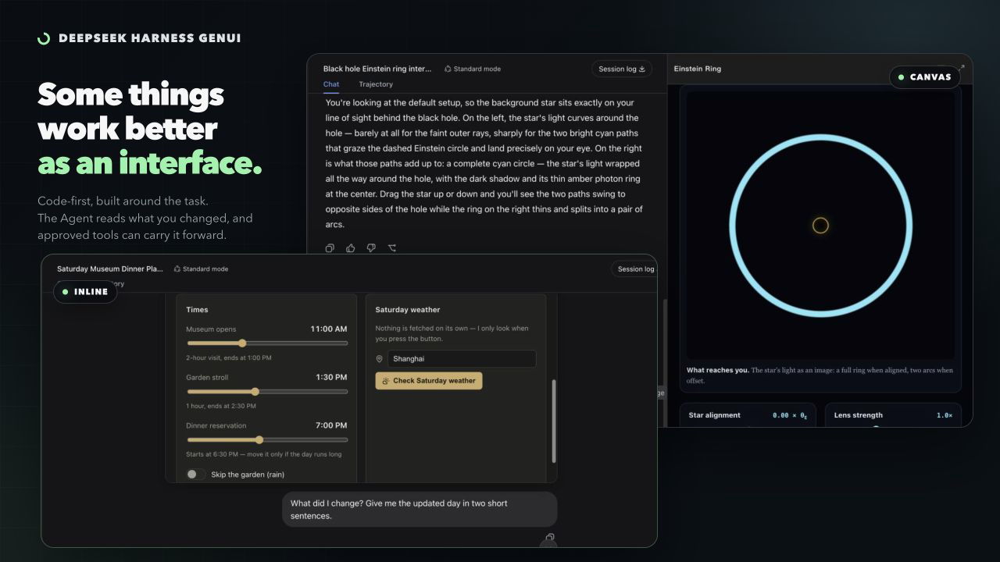
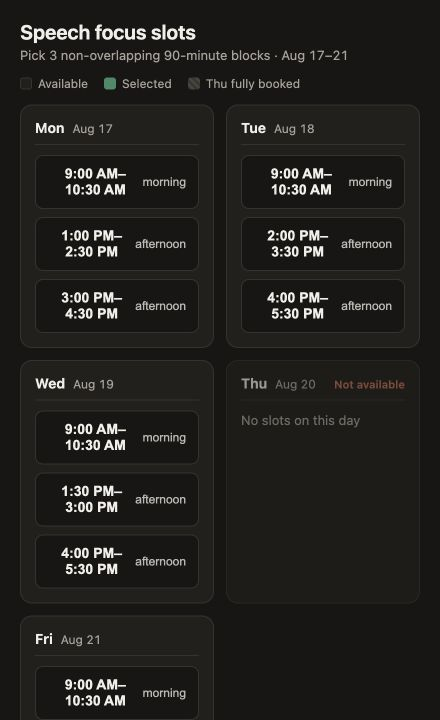
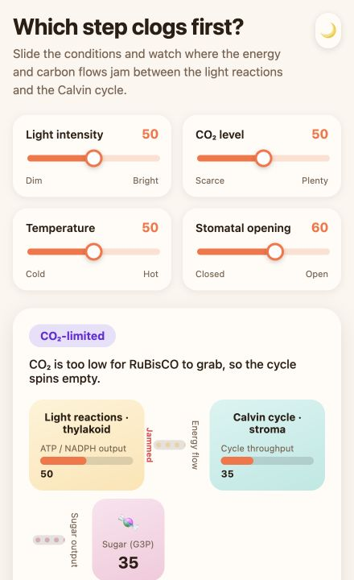
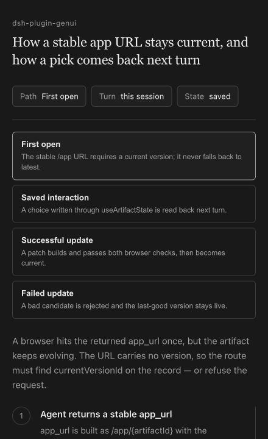
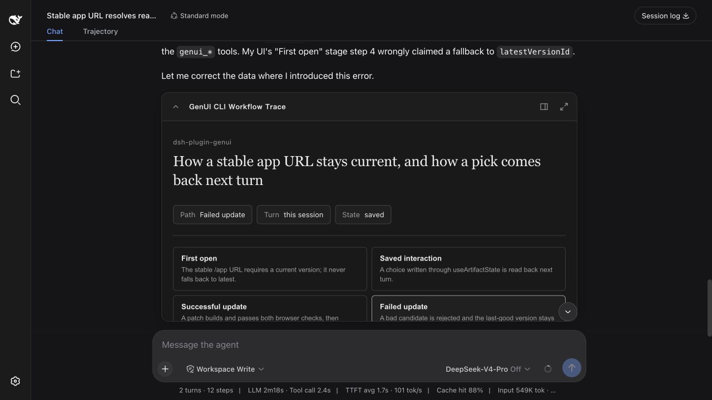
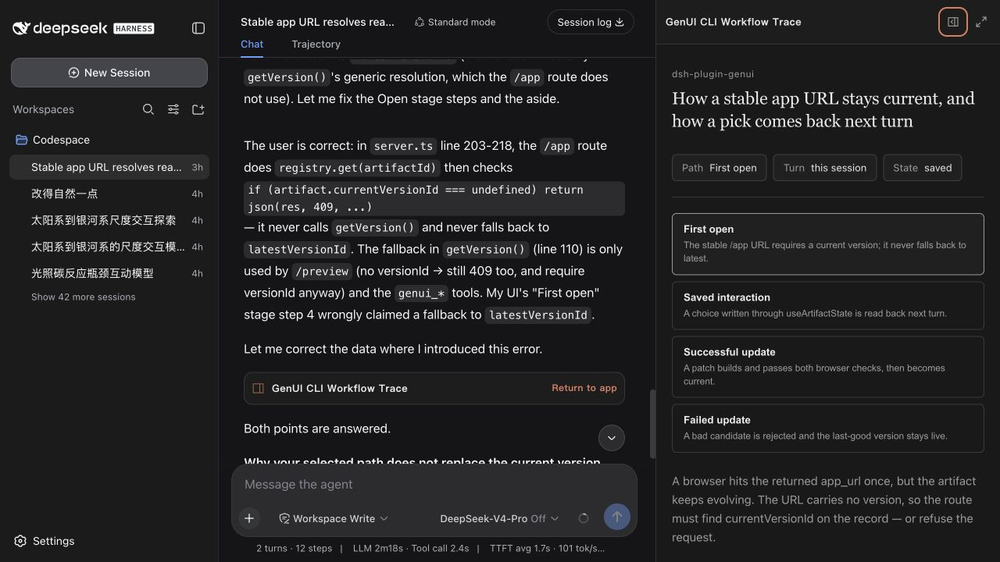

# DeepSeek Harness GenUI

English | [简体中文](README.zh-CN.md)

[](package.json)
[](LICENSE)



A DeepSeek Harness plugin for temporary, task-specific React apps. The Agent answers in prose and adds an interface only when the user needs to explore, compare, configure, or act. Each app is created for the task and opens ready to use.

> **Interaction loop:** The Agent creates an app → the user clicks, selects, types, or drags → the result returns to the task → the next Agent turn continues from it. The user does not have to translate the interaction back into prose.

## In Use

<table>
  <tr>
    <td><strong>Pick calendar slots</strong><br><br>Find useful 90-minute writing blocks and create only the confirmed events.<br><br>The app lays real availability side by side, keeps the selection, and asks before writing to the calendar.</td>
    <td></td>
  </tr>
  <tr>
    <td><strong>Explore photosynthesis</strong><br><br>Move light, carbon dioxide, temperature, and stomatal controls to find the limiting step.<br><br>The diagram changes with the controls, so the causal relationship is easier to test than to describe.</td>
    <td></td>
  </tr>
  <tr>
    <td><strong>Trace a code path</strong><br><br>Ask from the CLI for a source-grounded explanation of a real project flow.<br><br>The result is a local explorer with files, functions, branches, and the path selected by the user.</td>
    <td></td>
  </tr>
</table>

Plain questions, rewriting, summaries, and simple lists stay in prose.

## Inline & Canvas

The same app can sit inside the answer or open beside the conversation.

| Inline | Canvas |
| --- | --- |
|  |  |
| A compact control or focused choice. | More room without covering the conversation. |

Inline, Canvas, full screen, and localhost share one task state. Actions in any view return to the task for later Agent turns to read directly.

## CLI Example

The terminal profile returns a localhost app. A follow-up can refer to the path already selected in that app.

```text
❯ Explain how a generated app reaches the permission-gated runtime in this
  repository. Build an interactive code-path explorer and return a localhost URL.

  I mapped src/tools.ts → src/artifacts/builder.ts → src/runtime/server.ts
  → src/artifacts/registry.ts.

  http://127.0.0.1:<port>/genui/app/<task-app>

❯ Where does the path I selected stop?

  It reaches the permission check in src/runtime/server.ts, then stops before
  the connected tool runs because access has not been allowed.
```

## How It Works

1. The Agent keeps the explanation in the conversation and creates one focused interface when interaction adds value.
2. It writes React + TypeScript, declares the exact tools or public HTTPS routes it needs, then the plugin builds and checks the app.
3. Clicks, selections, text input, and control values are saved to the task. Later turns read the result directly; the user does not have to restate in prose what they expressed through the app.
4. Later edits update the same app without replacing a working version with a failed one.

Connected tools and APIs ask before first use. The app card shows current access and lets the user remove it. Credentials stay in the Harness.

## Design MD

Visual direction lives in `DESIGN.md`. Four profiles are included:

| Profile | Best fit |
| --- | --- |
| `editorial-workbench` | Reading, planning, forms, and content-heavy work |
| `ledger-grid` | Comparisons, schedules, evidence, and shortlists |
| `field-atlas` | Scientific, causal, and spatial explanations |
| `kinetic-signal` | Live data, connected tools, and user-triggered actions |

Open **Settings → Plugins → Plugin configuration** to use automatic selection, choose a profile, import a `DESIGN.md`, or export one as a starting point. The choice applies to new apps without adding design controls to them.

## Install

Use Node.js `^22.19.0 || >=24`. This release is tested with DeepSeek Harness `0.1.0-rc.6` and Cordis `4.0.0-rc.7`.

```sh
curl -fL https://github.com/pengyue-polaron/deepseek-harness-genui/releases/latest/download/dsh-plugin-genui.tgz -o /tmp/dsh-plugin-genui.tgz
dsh plugin --profile web add /tmp/dsh-plugin-genui.tgz
dsh plugin --profile web exec playwright install chromium
dsh --profile web
```

The Web profile supports Inline, Canvas, full screen, and localhost links. For a terminal profile, replace `web` with `tui`; TUI returns localhost links and does not embed Canvas. Connect MCP servers to the same profile as usual.

## Safety

Generated code runs in a sandbox. Tool calls and public HTTPS routes must be declared, scoped, and approved. Temporary links expire after 7 days; saved task state and access are removed after 7 days without activity. Return to the app card in the task to review or remove access.

The plugin uses DeepSeek Harness + Cordis, React 18 + TypeScript, esbuild, Playwright, and Vitest.

## Development

Building from source requires pnpm 11.

```sh
pnpm install
pnpm run typecheck
pnpm test
pnpm run package:plugin
```

[Acceptance scenarios](examples/real-user-scenarios.md) · [Screenshot guide](docs/CAPTURE_GUIDE.zh-CN.md) · [Contributing](CONTRIBUTING.md) · MIT
