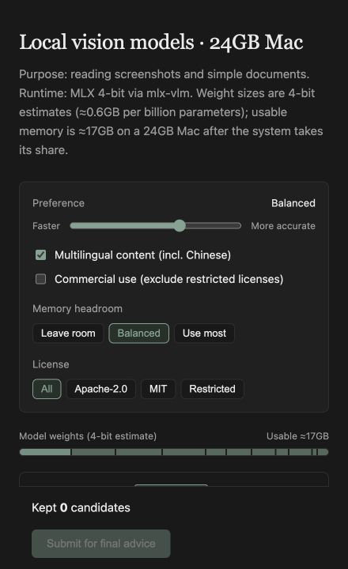

# DeepSeek Harness GenUI

English | [简体中文](README.zh-CN.md)

[](package.json)
[](LICENSE)


A DeepSeek Harness plugin that turns the interactive part of a task into a temporary React app. The answer stays in the conversation; a UI appears only when manipulating it is better than reading more prose.

**Ask → read → interact → continue from the saved state**

## In Use

<table>
  <tr>
    <td><strong>Compare tool-backed results</strong><br><br>Find vision models that can actually run on a 24 GB Mac using connected Hugging Face and GitHub sources.<br><br>The conversation keeps the memory, license, and implementation limits. The UI adds filters, evidence, and a saved shortlist.</td>
    <td></td>
  </tr>
  <tr>
    <td><strong>Configure a real action</strong><br><br>Find a few useful 90-minute writing slots, then create only the confirmed events.<br><br>The conversation keeps the recommendation and privacy boundary. The UI makes the schedule selectable and asks before writing.</td>
    <td></td>
  </tr>
  <tr>
    <td><strong>Manipulate a difficult idea</strong><br><br>Change light, carbon dioxide, temperature, and stomatal opening to see which step limits photosynthesis.<br><br>The conversation keeps definitions and caveats. The UI turns the causal model into something the user can test.</td>
    <td></td>
  </tr>
  <tr>
    <td><strong>Trace code from a CLI</strong><br><br>Explain a real project path and return a local browser app grounded in source files and functions.<br><br>The conversation keeps the explanation. The UI adds an explorable path, real source references, and a stable localhost URL.</td>
    <td></td>
  </tr>
</table>

Plain questions, rewriting, summaries, and simple lists stay in prose.

## CLI Example

The CLI path uses the same plugin. An explicit GenUI request returns a local app; a later turn reads the interaction instead of asking the user to repeat it.

```text
❯ Explain the IAM authentication path in this repository. Generate an
  interactive UI that maps each step to the real source and return a localhost URL.

  I traced oauthController.ts → tokenService.ts → openV1Controller.ts.
  The app lets you switch the entry path and request conditions.

  http://127.0.0.1:3090/genui/app/iam-auth-path

❯ I switched to OAuth, kept the credential valid, disabled the session hit,
  kept permission allowed, and opened step 7. Where does the request stop?

  It stops at step 6, “Exchange the user token and write the app session.”
  Step 7 is expanded for inspection, but it is not executed.
```

## Inline & Canvas

The same app starts Inline with the answer. Open it in Canvas when the task needs more room; the conversation narrows instead of being covered.

| Inline | Canvas |
| --- | --- |
|  |  |
| Best for a focused choice, control group, or small visual. | Best for deeper exploration while the conversation remains visible. |

Both modes share the same task state. Full-screen and stable localhost delivery are available when needed.

## How It Works

1. The Agent keeps ordinary answers in prose and creates a UI only when interaction materially improves the task.
2. It writes normal React + TypeScript, declares the exact connected tools or public API routes it needs, and receives a verified build.
3. The user interacts Inline, in Canvas, full-screen, or through a local URL.
4. Inputs, selections, drafts, and completed results are saved to the task. On the next turn, the Agent reads that state before answering.
5. Later requests update the same app. The URL and user state survive revisions; a failed revision does not replace the last working version.

Tool and MCP calls require permission on first use. Public HTTPS access is restricted to declared credential-free routes. API keys and connected-service credentials remain in the Harness.

## Design MD

Reusable visual direction lives in `DESIGN.md`, not a component-tree IR. The plugin includes 4 profiles:

| Profile | Best fit |
| --- | --- |
| `editorial-workbench` | Reading, planning, forms, and content-heavy work |
| `ledger-grid` | Comparisons, schedules, evidence, and shortlists |
| `field-atlas` | Scientific, causal, and spatial explanations |
| `kinetic-signal` | Live data, connected tools, and user-triggered actions |

Open **Settings → Plugins → Plugin configuration** to keep automatic selection, choose a profile, import a `DESIGN.md`, or export the current profile as a starting point. The Agent applies the selected direction silently; generated apps do not expose a design control panel.

## Install

Requires Node.js `^22.19.0 || >=24`, pnpm 11, and DeepSeek Harness.

```sh
curl -fL https://github.com/pengyue-polaron/deepseek-harness-genui/releases/latest/download/dsh-plugin-genui.tgz -o /tmp/dsh-plugin-genui.tgz
dsh plugin --profile web add /tmp/dsh-plugin-genui.tgz
dsh plugin --profile web exec playwright install chromium
dsh --profile web
```

Use `--profile tui` instead of `--profile web` for a compatible Harness terminal profile. Add MCP servers to that profile normally; generated apps use their exact tool names.

## Stack

| Host | Generated app | Build | State | Verification |
| --- | --- | --- | --- | --- |
| DeepSeek Harness + Cordis | React 18 + TypeScript | esbuild | Task-scoped | Playwright + Vitest |

Every build is checked at desktop and mobile widths, in light and dark color schemes, and with reduced motion.

## Development

```sh
pnpm install
pnpm run typecheck
pnpm test
pnpm run package:plugin
```

[Acceptance scenarios](examples/real-user-scenarios.md) · [Screenshot guide](docs/CAPTURE_GUIDE.zh-CN.md) · [Contributing](CONTRIBUTING.md) · MIT
