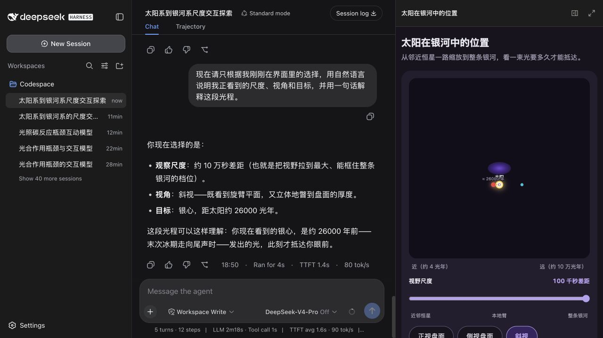

# DeepSeek Harness GenUI

[English](README.md) | 简体中文

[](package.json)
[](LICENSE)


一个 DeepSeek Harness 插件，把任务里适合操作的部分变成临时 React 页面。回答留在对话里；只有界面确实更好用时才生成界面。

**提出需求 → 阅读回答 → 操作界面 → 带着状态继续聊**

## 真实场景

<table>
  <thead>
    <tr>
      <th>需求</th>
      <th>Agent 回答</th>
      <th>生成的界面</th>
    </tr>
  </thead>
  <tbody>
    <tr>
      <td><strong>筛选本地视觉模型</strong><br><br>结合已连接的 Hugging Face 和 GitHub，找出能在 24 GB Mac 上实际运行的模型。</td>
      <td>说明内存、许可证和实现限制；下一轮直接读取保留的候选项。</td>
      <td><br><br>筛选、对比和候选清单。</td>
    </tr>
    <tr>
      <td><strong>安排专注时段</strong><br><br>读取下周空闲时间，只给出少量 90 分钟选项，确认后再写入日历。</td>
      <td>不泄露无关日程标题；下一轮能读回已经选择的三个时段。</td>
      <td><br><br>基于真实日历的选择面板。</td>
    </tr>
    <tr>
      <td><strong>理解光合作用瓶颈</strong><br><br>改变光照、二氧化碳、温度和气孔开度，观察限制步骤如何变化。</td>
      <td>解释光反应与卡尔文循环；下一轮结合界面里的具体条件继续回答。</td>
      <td><br><br>能量与物质流动随参数变化。</td>
    </tr>
    <tr>
      <td><strong>建立银河系尺度感</strong><br><br>从太阳附近逐步缩放到银河系，并切换观察视角。</td>
      <td>解释身处银河系内部时如何推断它的结构；下一轮读回尺度和视角。</td>
      <td><br><br>对数缩放、视角切换和光行时间对比。</td>
    </tr>
  </tbody>
</table>

普通问答和文字改写只返回文字，不额外生成界面。

## 功能

- 支持 Inline、自适应 Canvas、全屏和稳定的本地链接。
- 直接生成 React + TypeScript，不使用组件树 IR。
- 任务级状态会保留，Agent 下一轮可以读回。
- Harness 与 MCP 工具首次调用前明确申请权限。
- 可授权访问公开 HTTPS API，密钥不会暴露给页面代码。
- 支持导入 `DESIGN.md`、暗黑模式、移动端和无障碍检查。

## 安装

需要 Node.js `^22.19.0 || >=24`、pnpm 11、DeepSeek Harness 和 GitHub CLI。

```sh
gh release download --repo pengyue-polaron/deepseek-harness-genui --pattern dsh-plugin-genui.tgz --output /tmp/dsh-plugin-genui.tgz --clobber
dsh plugin --profile web add /tmp/dsh-plugin-genui.tgz
dsh plugin --profile web exec playwright install chromium
dsh --profile web
```

MCP 按照 Harness 原有方式连接。生成页面只调用已连接工具，凭据保留在 Harness 中。

## 设计

打开 **设置 → 插件 → 插件配置**，可使用自动风格、`notion-calm`、`material-expressive`，或导入自己的 `DESIGN.md`。

## 技术栈

| 宿主 | 页面 | 构建 | 状态 | 验证 |
| --- | --- | --- | --- | --- |
| DeepSeek Harness + Cordis | React 18 + TypeScript | esbuild | 任务级 | Playwright + Vitest |

## 开发

```sh
pnpm run typecheck
pnpm test
pnpm run package:plugin
```

[验收用例](examples/real-user-scenarios.md) · [截图指南](docs/CAPTURE_GUIDE.zh-CN.md) · MIT
