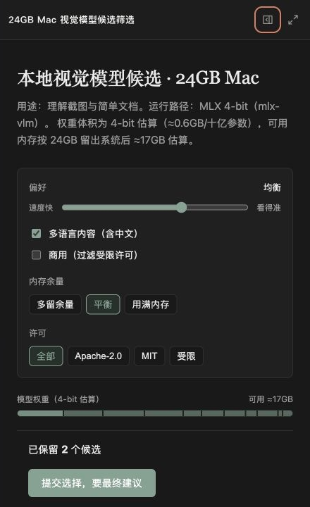

# DeepSeek Harness GenUI

[English](README.md) | 简体中文

[](package.json)
[](LICENSE)


一个 DeepSeek Harness 插件，把任务里适合操作的部分变成临时 React 页面。回答留在对话里；只有操作界面确实比继续读文字更有效时，才生成界面。

**提出需求 → 阅读回答 → 操作界面 → 带着保存的状态继续聊**

## 真实场景

<table>
  <tr>
    <td><strong>比较真实工具结果</strong><br><br>结合已连接的 Hugging Face 和 GitHub，找出能在 24 GB Mac 上实际运行的视觉模型。<br><br>对话保留内存、许可证和实现限制；界面负责筛选、比较证据和保存候选清单。</td>
    <td></td>
  </tr>
  <tr>
    <td><strong>配置一次真实操作</strong><br><br>找出少量合适的 90 分钟写作时段，只创建最终确认的日程。<br><br>对话保留推荐理由和隐私边界；界面让时间可选择，并在写入前申请授权。</td>
    <td></td>
  </tr>
  <tr>
    <td><strong>操纵难以描述的概念</strong><br><br>改变光照、二氧化碳、温度和气孔开度，观察哪一步先成为光合作用瓶颈。<br><br>对话保留定义和必要边界；界面让用户亲自验证因果关系。</td>
    <td></td>
  </tr>
  <tr>
    <td><strong>从 CLI 追踪真实代码</strong><br><br>解释项目里的实际路径，并返回映射到源码文件和函数的本地页面。<br><br>对话保留代码解释；界面提供可探索的路径、真实源码引用和稳定的 localhost 地址。</td>
    <td></td>
  </tr>
</table>

普通问答、文字改写、摘要和简单列表只返回文字。

## CLI 示例

CLI 使用同一个插件。明确要求 GenUI 后，Harness 会返回本地页面；下一轮可以直接读取页面里的操作，不需要用户重新描述。

```text
❯ 解释这个仓库里的 IAM 认证链路。生成一个交互式界面，把每一步映射到真实源码，
  然后返回 localhost 地址。

  我追踪了 oauthController.ts → tokenService.ts → openV1Controller.ts。
  页面可以切换认证入口和请求条件。

  http://127.0.0.1:3090/genui/app/iam-auth-path

❯ 我切换到了 OAuth，保持凭证有效，关闭 Session 命中，保留权限通过，
  并展开了第 7 步。请求会停在哪里？

  请求停在第 6 步“换用户 token + 写应用 session”。
  第 7 步虽然被展开查看，但不会执行。
```

## Inline 与 Canvas

同一个页面先跟随回答显示为 Inline。任务需要更大空间时，可以在 Canvas 中打开；对话区会自适应变窄，不会被页面盖住。

| Inline | Canvas |
| --- | --- |
|  |  |
| 适合一个聚焦选择、一组控制或小型可视化。 | 适合在保留对话的同时进行更深入的探索。 |

两种模式共享同一份任务状态。需要时还可以全屏打开，或通过稳定的 localhost 地址访问。

## 工作方式

1. Agent 把普通回答留在文字里，只在交互确实能改善任务时创建界面。
2. 它直接编写 React + TypeScript，声明需要的真实工具或公开 API 范围，并得到经过检查的构建结果。
3. 用户可以在 Inline、Canvas、全屏或本地链接中操作。
4. 输入、选择、草稿和完成结果会保存到当前任务。下一轮回答前，Agent 会先读取这些状态。
5. 后续要求会更新同一个页面。URL 和用户状态跨版本保留；更新失败时继续使用最后一个正常版本。

工具和 MCP 首次调用前会明确申请权限。公开 HTTPS 请求只能访问声明过的无凭据范围；API Key 和外部服务凭据始终留在 Harness 中。

## Design MD

可复用的视觉方向写在 `DESIGN.md`，而不是组件树 IR。插件内置 4 套风格：

| 风格 | 适用场景 |
| --- | --- |
| `editorial-workbench` | 阅读、规划、表单和内容密集型任务 |
| `ledger-grid` | 对比、排程、证据和候选清单 |
| `field-atlas` | 科学、因果和空间概念解释 |
| `kinetic-signal` | 实时数据、连接工具和用户触发操作 |

打开 **设置 → 插件 → 插件配置**，可以保留自动选择、指定内置风格、导入 `DESIGN.md`，或导出当前风格作为自己的起点。Agent 会静默应用选定方向，不会在生成页面里再放一套设计设置。

## 安装

需要 Node.js `^22.19.0 || >=24`、pnpm 11 和 DeepSeek Harness。

```sh
curl -fL https://github.com/pengyue-polaron/deepseek-harness-genui/releases/latest/download/dsh-plugin-genui.tgz -o /tmp/dsh-plugin-genui.tgz
dsh plugin --profile web add /tmp/dsh-plugin-genui.tgz
dsh plugin --profile web exec playwright install chromium
dsh --profile web
```

兼容的 Harness 终端配置可以把 `--profile web` 换成 `--profile tui`。MCP 按照原有方式连接到同一个 profile；生成页面使用它们的准确工具名。

## 技术栈

| 宿主 | 生成页面 | 构建 | 状态 | 验证 |
| --- | --- | --- | --- | --- |
| DeepSeek Harness + Cordis | React 18 + TypeScript | esbuild | 任务级 | Playwright + Vitest |

每次构建都会检查桌面端和移动端宽度、浅色和暗色模式，以及减少动态效果的环境。

## 开发

```sh
pnpm install
pnpm run typecheck
pnpm test
pnpm run package:plugin
```

[验收场景](examples/real-user-scenarios.md) · [截图指南](docs/CAPTURE_GUIDE.zh-CN.md) · [参与贡献](CONTRIBUTING.md) · MIT
