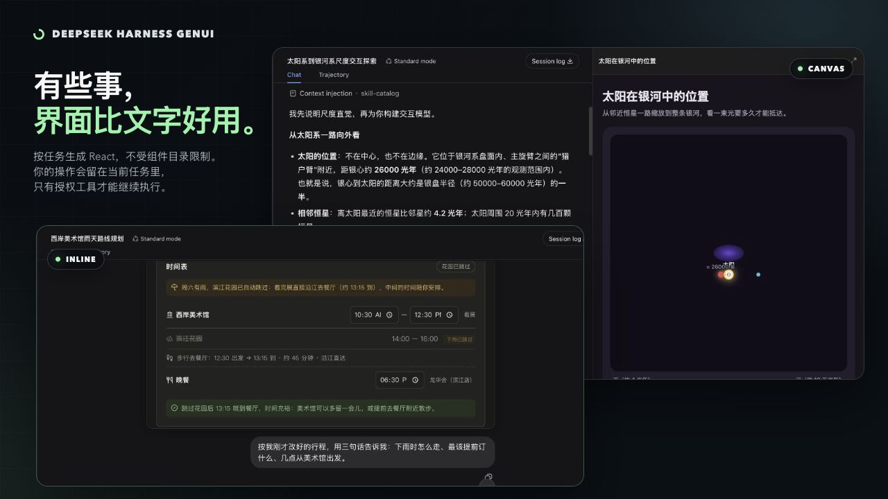
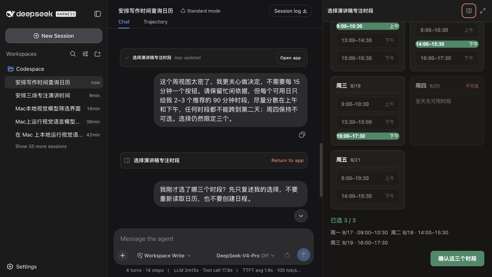
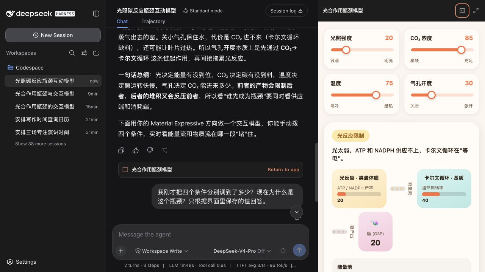
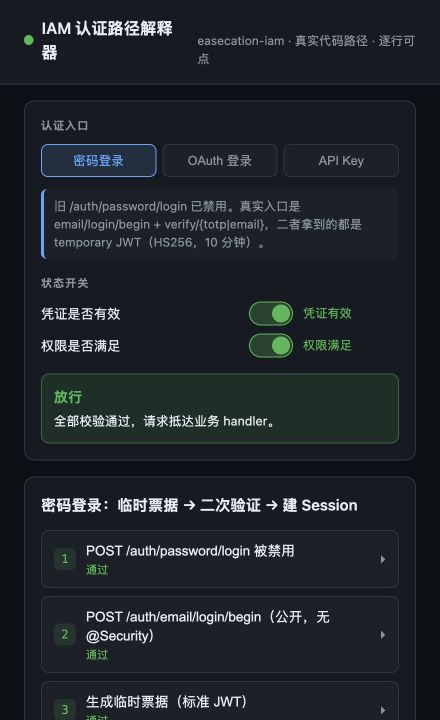
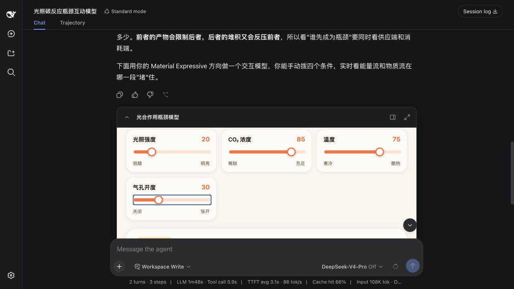
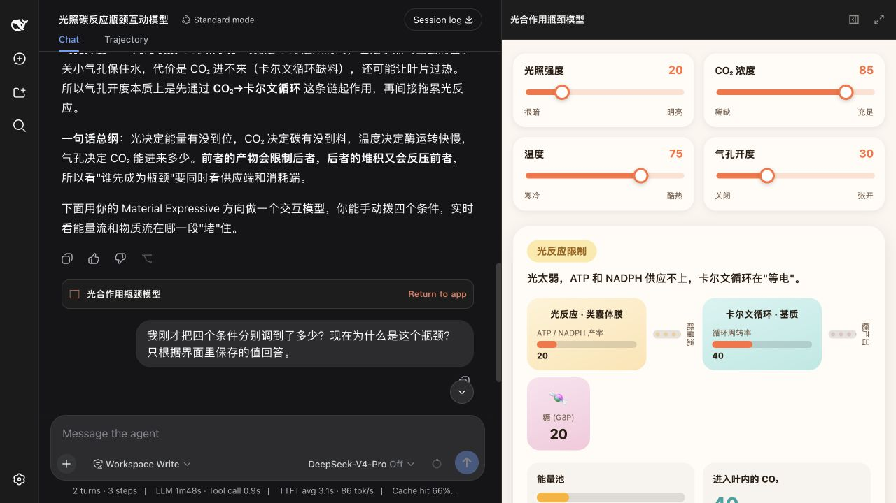

# DeepSeek Harness GenUI

[English](README.md) | 简体中文

[](package.json)
[](LICENSE)



有些任务用文字来回描述很别扭。DeepSeek Harness GenUI 让 Agent 可以为当前任务生成一个聚焦界面，用来讲清复杂关系，或收集难以用一段话表达的用户选择。

这个插件走 code-first 路线。Coding Agent 编写普通前端代码——React + TypeScript，而不是组件树 DSL 或 IR。界面可以保存用户的选择、输入和修改，供 Agent 在下一轮读取并继续处理任务。

## 什么时候值得生成界面

当用户需要看清一个复杂关系，或同时处理几项相互影响的选择时，界面比文字更合适。普通问答、文字改写、摘要和简单列表仍然只返回文字。

<table>
  <tr>
    <td><strong>选择日历时段</strong><br><br>把候选空闲时间变成一组可以直接操作的 90 分钟时段。<br><br>页面把选中的三个时段保存回任务；后续如需写入日历，仍要单独申请授权。</td>
    <td></td>
  </tr>
  <tr>
    <td><strong>探索光合作用</strong><br><br>改变光照、二氧化碳、温度和气孔开度，找到限制反应的环节。<br><br>图示会跟随控制项变化，用户可以直接观察各变量如何影响结果。</td>
    <td></td>
  </tr>
  <tr>
    <td><strong>追踪代码路径</strong><br><br>从 CLI 要求 Agent 根据真实项目源码解释一条执行链路。<br><br>返回的本地页面列出文件、函数、分支，以及用户当前选中的路径。</td>
    <td></td>
  </tr>
</table>

## Inline 与 Canvas

同一个页面既可以放在回答里，也可以在对话右侧打开。

| Inline | Canvas |
| --- | --- |
|  |  |
| 适合紧凑的控制项或聚焦选择。 | 提供更大空间，同时保留对话。 |

Inline、Canvas、全屏和 CLI/localhost 是同一份任务状态的不同入口。在任一入口保存的选择和输入，都可以在 Agent 后续轮次继续使用。

## CLI 示例

终端 profile 会返回 localhost 页面。下一轮可以直接引用用户刚才在页面里选择的路径。

```text
❯ 解释这个仓库里生成页面如何进入带权限控制的运行时。做一个交互式代码路径页面，
  然后返回 localhost 地址。

  我梳理了 src/tools.ts → src/artifacts/builder.ts → src/runtime/server.ts
  → src/artifacts/registry.ts。

  http://127.0.0.1:<port>/genui/app/<task-app>

❯ 我刚才选的路径停在哪里？

  它到达了 src/runtime/server.ts 的权限检查，然后停在真实工具调用之前，
  因为这项访问还没有获得允许。
```

## 工作方式

1. Agent 编写普通的 React + TypeScript，插件负责构建和检查。
2. 界面把选择、表单答案、草稿和进度等有意义的结果保存到当前任务。用户继续追问时，Agent 可以读取这些结果，不必让用户重新描述。
3. 页面只声明实际需要的 Harness/MCP/Skill 工具，或无需凭据的公开 HTTPS 接口。首次调用前请求授权，授权只对当前任务有效；未声明的调用会被拒绝。
4. 后续修改更新同一个页面。失败的更新不会覆盖当前可用版本。

Web 端可以从页面卡片查看或撤回权限。MCP 凭据不会进入生成代码。

## DESIGN.md

打开 **设置 → 插件 → 插件配置**，可以为新应用设置默认设计：让插件自动选择、选用内置风格、导入自定义 `DESIGN.md`，或导出当前选中的设计作为起点。选定后，它会成为之后新建应用的默认设计，不必在每个提示词里重复描述风格。已经生成的应用会保留原来的设计。

`DESIGN.md` 控制的是设计语言，不是页面结构。React + TypeScript 仍然可以按任务需要实现模拟器、图形、地图、时间轴、代码图、动画和不规则布局。

| 风格 | 适用场景 |
| --- | --- |
| `editorial-workbench` | 阅读、规划、表单和内容密集型任务 |
| `ledger-grid` | 对比、排程、证据和候选清单 |
| `field-atlas` | 科学、因果和空间概念解释 |
| `kinetic-signal` | 变化中的数据、连接工具和用户触发操作 |

## 安装

使用 Node.js `^22.19.0 || >=24`。插件支持 DeepSeek Harness `^0.1.0-rc.6`。

```sh
dsh plugin --profile web add dsh-plugin-genui
dsh plugin --profile web exec playwright install chromium
dsh --profile web
```

Web profile 支持 Inline、Canvas、全屏和 localhost 链接。终端 profile 把命令里的 `web` 换成 `tui`；TUI 返回本地链接，不嵌入 Canvas。MCP 仍按原有方式连接到同一个 profile。

## 安全

生成代码在沙箱中运行。页面直连 API 只支持已声明、无需凭据的公开 HTTPS 接口。临时链接和已授予权限会在 7 天后失效；任务状态在最后一次更新 7 天后过期。用户可以回到任务里的页面卡片查看或收回权限。

插件使用 DeepSeek Harness + Cordis、React 18 + TypeScript、esbuild、Playwright 和 Vitest。

## 开发

从源码构建需要 pnpm 11。

```sh
pnpm install
pnpm run typecheck
pnpm test
pnpm run package:plugin
```

[验收场景](examples/real-user-scenarios.md) · [截图指南](docs/CAPTURE_GUIDE.zh-CN.md) · [参与贡献](CONTRIBUTING.md) · MIT
